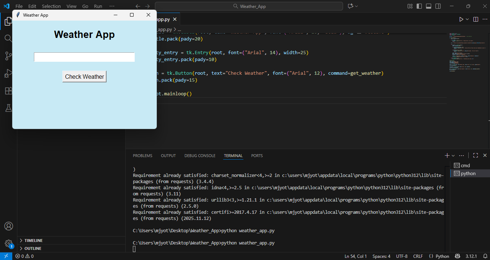

# 🌦️ Weather App (Python – Tkinter + OpenWeather API)

A simple and beginner-friendly **Weather Application** built using **Python**, **Tkinter GUI**, and the **OpenWeatherMap API**.  
Users can enter any city name and instantly view real-time weather details.

---

## 🚀 Features
- 🌍 Fetches **live weather data**
- 🖥️ Simple and clean **Tkinter graphical interface**
- 🌡️ Displays **temperature**, **humidity**, and **weather condition**
- ⚡ Works for any valid city
- 🔰 Perfect for beginner Python projects and GitHub portfolios

---

## 📸 Screenshots

### **1️⃣ Main App Window**
Before entering any city:

### **2️⃣ Weather Result**
After entering a city name and clicking "Check Weather":

---

## 🛠️ Technologies Used
- **Python 3**
- **Tkinter** (GUI framework)
- **Requests** (to call weather API)
- **OpenWeatherMap API**

---

## 📂 Project Structure
